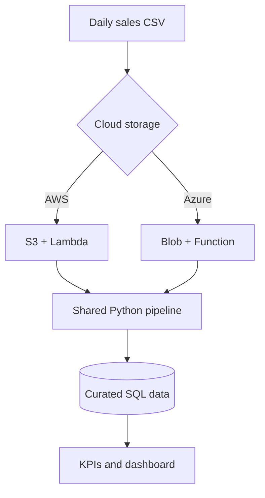

# Multi-Cloud Sales Intelligence Pipeline

[](https://github.com/josepharayemi-netizen/multicloud-sales-pipeline/actions/workflows/ci.yml)

An interview-ready data engineering project that processes retail sales data with one reusable Python pipeline and deploys the same workload to AWS or Microsoft Azure.

## Business problem

A retail company receives daily sales files from several branches. Leadership needs trustworthy KPIs without manually cleaning spreadsheets. This project validates transactions, rejects invalid records, calculates revenue and profit, loads curated data into SQL, and publishes summary metrics.

## Architecture



## What this demonstrates

- Python ETL and reusable data-quality rules
- SQL analytics and dimensional reporting
- AWS S3/Lambda and Azure Blob/Functions patterns
- Terraform infrastructure as code
- Dockerized local execution
- Automated testing and GitHub Actions CI
- Idempotent processing using a transaction key

## Quick start

Requirements: Python 3.11+

```bash
python -m venv .venv
source .venv/bin/activate       # Windows: .venv\\Scripts\\activate
pip install -r requirements.txt
python -m src.pipeline --input data/raw/sales.csv --output data/processed --database data/sales.db
python -m src.report --database data/sales.db
pytest
```

Or run with Docker:

```bash
docker compose up --build
```

## Generated outputs

- `data/processed/clean_sales.csv`: validated transactions
- `data/processed/rejected_sales.csv`: rejected rows with reasons
- `data/sales.db`: SQLite warehouse for local demonstration
- Console KPI report: revenue, profit, orders, average order value, and top region/product

## Data contract

| Field | Type | Rule |
|---|---|---|
| transaction_id | string | Required and unique |
| order_date | date | ISO date required |
| region | string | Required |
| product | string | Required |
| quantity | integer | Greater than zero |
| unit_price | decimal | Non-negative |
| unit_cost | decimal | Non-negative |

`revenue = quantity × unit_price`; `profit = quantity × (unit_price − unit_cost)`.

## Deploying to AWS

The Terraform starter in `infrastructure/aws` provisions an encrypted S3 landing bucket and Lambda execution role. The included cloud adapter is ready to package as the next deployment step. Configure AWS credentials, then run:

```bash
cd infrastructure/aws
terraform init
terraform plan
terraform apply
```

## Deploying to Azure

The Terraform starter in `infrastructure/azure` provisions a resource group, secure storage account, and private blob container. The shared handler can then be wrapped in an Azure Function. Authenticate with Azure CLI, then run the same Terraform commands from `infrastructure/azure`.

## Analytics queries

See `sql/analytics.sql` for revenue and profit by month, region, and product. The SQL is intentionally portable for adaptation to PostgreSQL, Amazon Redshift, or Azure SQL.

## Repository map

```text
src/                  shared ETL and KPI code
tests/                unit and integration tests
data/                 sample input and generated outputs
sql/                  warehouse schema and analytics
infrastructure/aws/   AWS Terraform
infrastructure/azure/ Azure Terraform
.github/workflows/    continuous integration
```

## Suggested interview walkthrough

1. Explain the business need and the shared multi-cloud processing core.
2. Demonstrate rejected rows and why observability matters.
3. Run the tests and GitHub Actions workflow.
4. Compare AWS and Azure service mappings and trade-offs.
5. Describe production extensions: secrets manager, private networking, orchestration, warehouse loading, and Power BI.

## Security and cost controls

- Storage encryption and public-access blocking are enabled in Terraform.
- No credentials are committed; authentication uses environment or workload identity.
- Resource names are randomized to avoid collisions.
- Run `terraform destroy` after a demonstration to avoid ongoing charges.

## License

MIT
